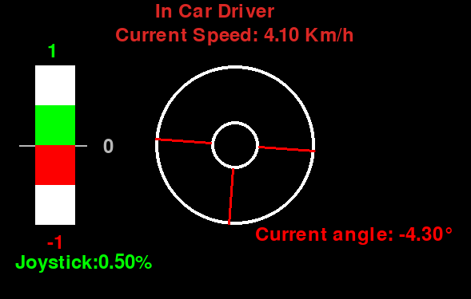

# `gui_teleop` ROS 2 package

GUI for teloperation in `ROS 2` `Humble`

[](https://docs.ros.org/en/humble/)




## Build this `ROS 2` package

In the following `~/ros2_ws` is assumed as the ROS 2 workspace:

``` bash
cd ~/ros2_ws/src
```

``` bash
clone
```

``` bash
cd ~/ros2_ws/
```

``` bash
colcon build --symlink-install --packages-select gui_teleop
```


## Run `ROS 2` node / launch file

``` bash
source ~/ros2_ws/install/setup.bash
```


# Publish ROS Topics
To mimic some data from the ROS simulation, publish topics using the following commands in separate terminals:

```bash
ros2 topic pub /lexus3/pacmod/vehicle_speed_rpt pacmod3_msgs/msg/VehicleSpeedRpt "{header: {stamp: {sec: 0, nanosec: 0}, frame_id: 'map'}, vehicle_speed: 0.1, vehicle_speed_valid: true}" 

ros2 topic pub /lexus3/cmd_vel geometry_msgs/msg/Twist '{linear: {x: 5.5, y: 0.0, z: 0.0}, angular: {x: 0.0, y: 0.0, z: 0.1}}' 

ros2 topic pub /lexus3/pacmod/steering_aux_rpt pacmod3_msgs/msg/SteeringCmd '{header: {stamp: {sec: 0, nanosec: 0}, frame_id: "frame"}, enable: true, ignore_overrides: false, clear_override: false, command: 0.5, rotation_rate: 1.0}' 

ros2 topic pub --once /lexus3/pacmod/steering_cmd pacmod3_msgs/msg/SteeringAuxRpt '{header: {stamp: {sec: 0, nanosec: 0}, frame_id: "frame"}, steering_torque: 0.5, rotation_rate: 1.0, operator_interaction: false, rotation_rate_sign: false, vehicle_angle_calib_status: true, steering_limiting_active: false, steering_torque_avail: true, rotation_rate_avail: true, operator_interaction_avail: true, rotation_rate_sign_avail: true, vehicle_angle_calib_status_avail: true, steering_limiting_active_avail: true}' 

ros2 topic pub /lexus3/pacmod/enabled std_msgs/msg/Bool '{data: true}'

ros2 topic pub -r 5 /joy sensor_msgs/Joy "{header:{stamp:{sec: 0, nanosec: 0}, frame_id: 'frame'}, axes:[0.0, 0.0, 0.0, 0.0, 0.0, 0.0, 0.0, 0.0, 0.0, 0.0, 0.0], buttons:[0, 0, 0, 0, 0, 0, 0, 0, 0, 0, 0]}"

```

## Acknowledgement
Based on https://github.com/Farraj007/Jkk-task